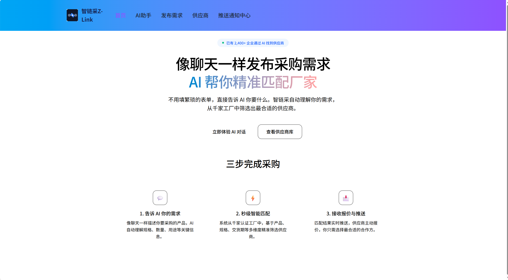
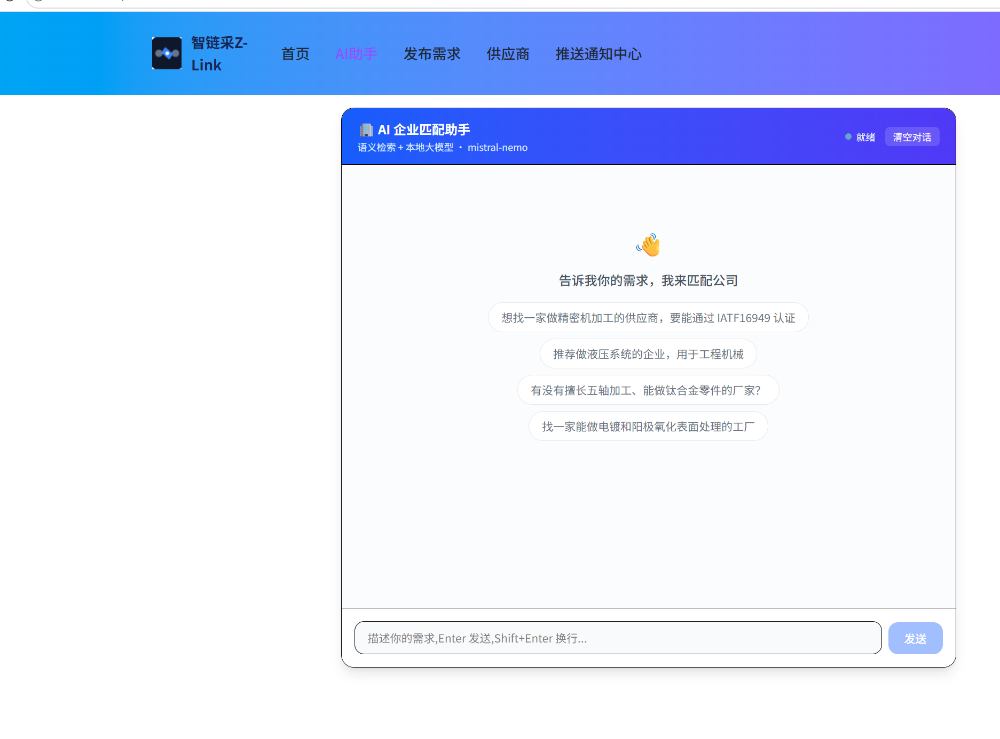
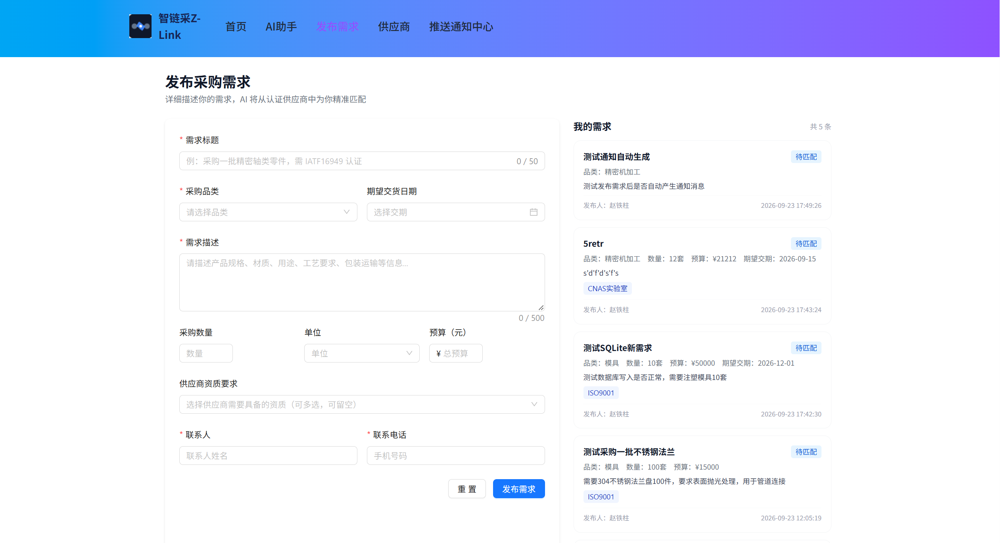
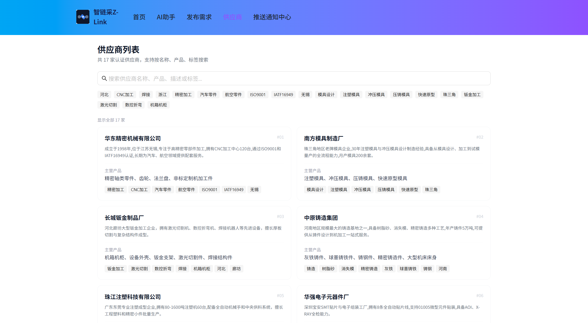
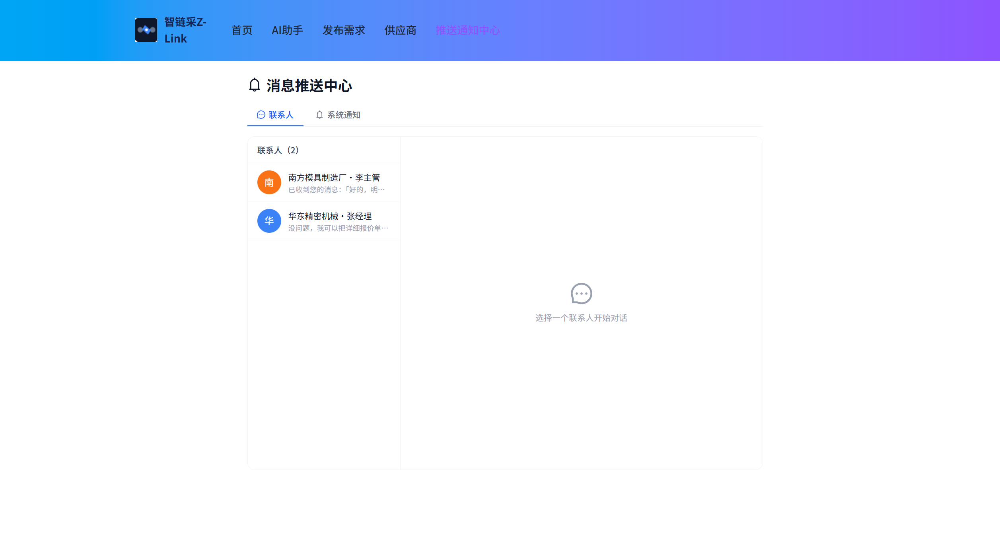

# Z-LINK

React + TypeScript + Vite application.

This template provides a minimal setup to get React working in Vite with HMR and some Oxlint rules.

Currently, two official plugins are available:

- [@vitejs/plugin-react](https://github.com/vitejs/vite-plugin-react/blob/main/packages/plugin-react) uses [Oxc](https://oxc.rs)
- [@vitejs/plugin-react-swc](https://github.com/vitejs/vite-plugin-react/blob/main/packages/plugin-react-swc) uses [SWC](https://swc.rs/)

## React Compiler

The React Compiler is not enabled on this template because of its impact on dev & build performances. To add it, see [this documentation](https://react.dev/learn/react-compiler/installation).

## Expanding the Oxlint configuration

If you are developing a production application, we recommend enabling type-aware lint rules by installing `oxlint-tsgolint` and editing `.oxlintrc.json`:

```json
{
  "$schema": "./node_modules/oxlint/configuration_schema.json",
  "plugins": ["react", "typescript", "oxc"],
  "options": {
    "typeAware": true
  },
  "rules": {
    "react/rules-of-hooks": "error",
    "react/only-export-components": ["warn", { "allowConstantExport": true }]
  }
}
```

See the [Oxlint rules documentation](https://oxc.rs/docs/guide/usage/linter/rules) for the full list of rules and categories.

 # Z-LINK

 Z-LINK 是一个面向企业信息发现与供需匹配的 React Web 应用。用户可以浏览企业信息、发布企业资料，并通过浏览器内运行的 AI 助手，根据自然语言需求获得企业匹配结果。

 ## 项目截图

 ### 首页

 

 ### AI 企业匹配助手

 

 ### 发布采购需求

 

 ### 供应商列表

 

 ### 消息推送中心

 

 ## 功能

 - 用户登录、注册与受保护路由
 - 企业信息浏览、个人资料和企业发布页面
 - 基于自然语言的企业语义匹配
 - 匹配结果展示企业名称、产品、简介、标签和匹配度
 - 浏览器本地运行 Qwen2.5-3B-Instruct 对话模型
 - 使用 Embedding 模型建立企业向量索引，并通过余弦相似度计算候选结果
 - AI 回复流式输出，并展示模型加载与索引构建进度

 ## 技术栈

 - React 19 + TypeScript
 - Vite
 - React Router
 - Redux Toolkit + Zustand
 - Ant Design + Tailwind CSS
 - Transformers.js
 - MLC WebLLM
 - WebGPU

 ## 快速开始

 ### 环境要求

 - Node.js 18+
 - 支持 WebGPU 的浏览器，推荐 Chrome 126+ 或 Edge 126+
 - 能够运行本地模型的显卡和足够的浏览器缓存空间

 ### 安装与启动

 ```bash
 npm install
 npm run dev
 ```

 启动后访问终端中显示的本地地址。

 ### 生产构建

 ```bash
 npm run build
 npm run preview
 ```

 首次进入 AI 助手页面时，应用会在浏览器中加载 Embedding 模型和 Qwen 对话模型。模型文件位于 `public/models`，首次加载可能需要较长时间，之后通常会使用浏览器缓存。

 ## 项目结构

 ```text
 src/
 ├── api/                 API 与供应商数据请求
 ├── page/                页面与业务模块
 │   ├── Login/           登录与注册
 │   └── assistant/       AI 企业匹配助手
 ├── router/              路由与登录权限控制
 ├── shared/              Header、Container 等公共组件
 ├── store/               全局状态和登录状态
 └── utils/               请求封装、匹配算法和鉴权工具
 public/models/           本地 Embedding 与 LLM 模型文件
 ```

 ## AI 匹配流程

 1. 检测浏览器是否支持 WebGPU。
 2. 加载 BGE Embedding 模型和 Qwen2.5-3B-Instruct 模型。
 3. 为企业名称、简介和产品信息预计算向量并建立索引。
 4. 将用户的自然语言需求转换为向量，与企业向量计算余弦相似度。
 5. 返回 Top 3 候选企业，并将匹配结果交给本地大模型生成推荐理由。

 ## 环境变量

 本地环境配置文件不会提交到 Git。请根据实际部署环境创建 `.env.development` 或 `.env.production`，例如：

 ```bash
 VITE_API_URL=http://localhost:3000
 ```

 ## 许可证

 项目依赖及模型文件请分别遵循其各自的许可证和使用条款。
